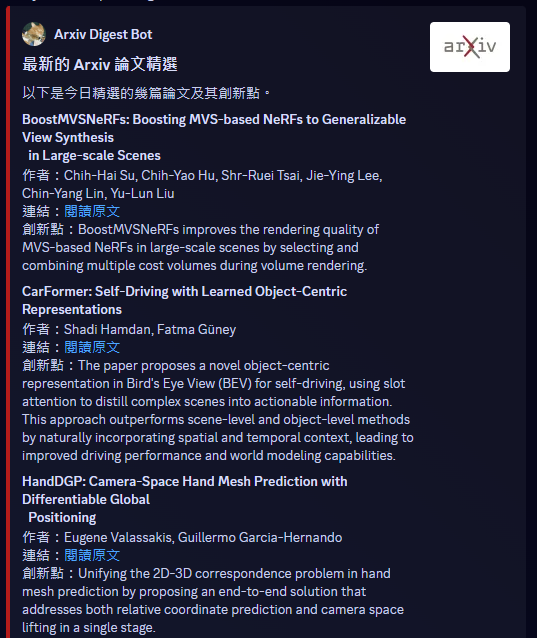

# Arxiv Daily Digest

This is a simple script that sends you an Discord notify every day with the latest papers from arxiv in the Computer Science category.

## Tech Stack

- Python
- FastAPI
- Redis
- Langchain
- Docker

## How to use

### 1. Clone the repository

```bash
git clone https://github.com/hibana2077/Arxiv_Daily
```

### 2. Create a Discord Webhook

Create a Discord Webhook and copy the URL.

### 3. Create a Groq API Key

Create a Groq API Key at [groq](https://groq.com/)

### 4. Settup the environment variables at docker-compose.yml

```yml
  discord_webhook:
    build: ./discord_webhook
    environment:
      BACKEND_URL: "http://backend:8081"
      DISCORD_WEBHOOK_URL: "YOUR_DISCORD_WEBHOOK_URL"
      DAILY_SEND_TIME: "09:00" # The time you want to receive the daily digest
      TZ: "Asia/Tokyo"
    networks:
      - arxiv-dayli-net

  backend:
    build: ./backend
    ports:
      - "8081:8081"
    volumes:
      - ./backend:/app
    environment:
      HOST: "0.0.0.0"
      GROQ_API_TOKEN: "YOUR_GROQ_API"
      REDIS_SERVER: "db"
      REDIS_PORT: 6379
      TZ: "Asia/Tokyo"
    depends_on:
      - db
    networks:
      - arxiv-dayli-net
```

### 5. Run the docker-compose

```bash
docker compose up -d --build
```

## Demo

